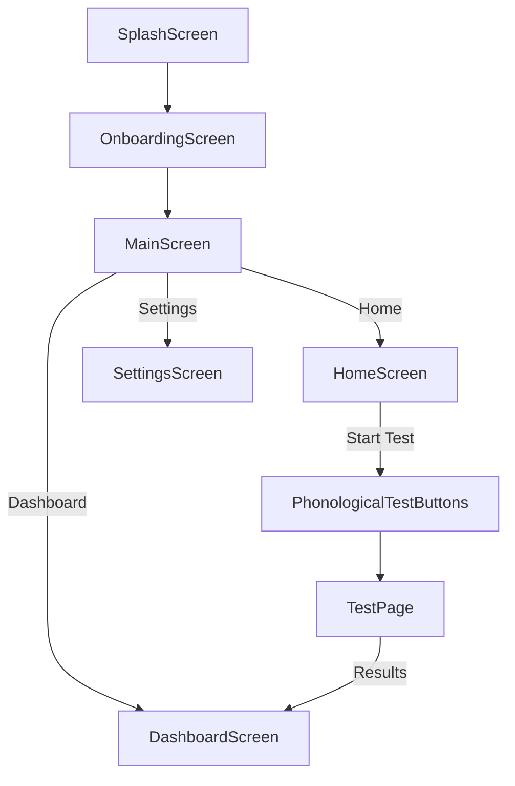
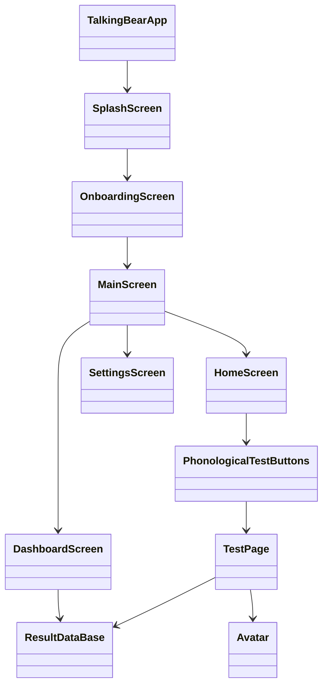
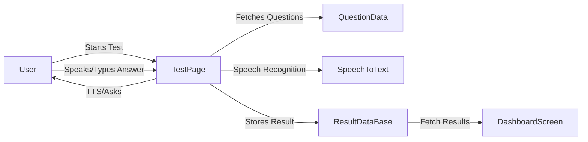
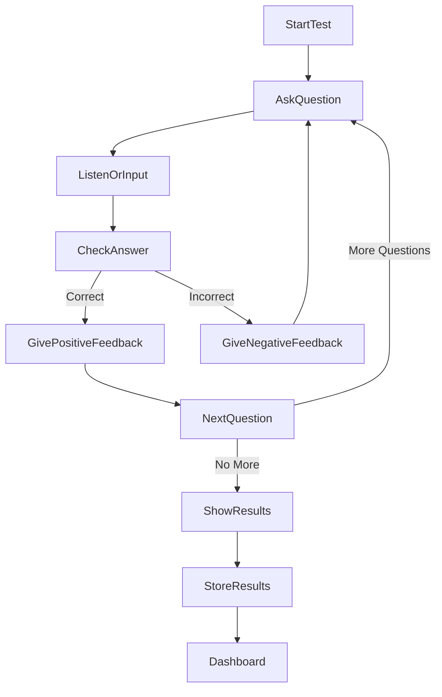

# PhonoPlay Project Report

## Table of Contents
1. [About the Project](#about-the-project)
2. [Main Features & Modules](#main-features--modules)
3. [Architecture & Flow](#architecture--flow)
4. [How It Works](#how-it-works)
5. [User Guide](#user-guide)
6. [Download & Installation](#download--installation)
7. [Key Classes & Code Listings](#key-classes--code-listings)
    - [TestPage](#testpage)
    - [ResultDataBase](#resultdatabase)
    - [Avatar](#avatar)
    - [Question Structure](#question-structure)
    - [Database Usage](#database-usage)
    - [Test Selection UI](#test-selection-ui)
8. [Diagrams & Flowcharts](#diagrams--flowcharts)
9. [How to Run](#how-to-run)
10. [Credits](#credits)

---

## About the Project

**PhonoPlay** is a professional phonological assessment and speech therapy application designed for healthcare professionals, educators, and speech-language pathologists. It leverages real-time speech analysis, personalized therapy plans, progress tracking, and professional-grade accuracy, all wrapped in a playful, child-friendly interface featuring a talking bear avatar.

---

## Main Features & Modules

- **Onboarding:** Welcomes users, introduces the app, and explains the scoring system.
- **Home Screen:** Main navigation hub with quick access to tests, dashboard, and settings.
- **Phonological Tests:** Multiple test types: Rhyming, Syllables, Segmenting, Blending, Initial/Middle/Final Sound.
- **Speech Analysis:** Uses speech-to-text and text-to-speech for interactive assessments.
- **Dashboard:** Displays user progress, analytics, and test results.
- **Settings:** Allows customization of user experience.
- **3D Avatar:** Animated bear avatar provides feedback and engagement.
- **Data Storage:** Local SQLite database for storing test results and analytics.

---

## Architecture & Flow

### App Navigation & Flow


### Architecture Diagram


### Data Flow Diagram


### Test Flow


---

## How It Works

- The app starts with a splash and onboarding screen, introducing the user to the app and its features.
- The main screen provides navigation to Home, Dashboard, and Settings.
- The Home screen allows users to start a phonological test.
- When a test is started, the `TestPage` loads the relevant questions and uses TTS to read them aloud.
- The user answers by speaking or typing. The app uses speech-to-text to capture spoken answers.
- The answer is checked for correctness, and the bear avatar provides visual feedback (correct/wrong/waiting/asking).
- After all questions, the score is calculated and stored in the local database.
- The Dashboard displays all past results and analytics.

---

## User Guide

### Step-by-Step Usage
1. **Launch the App:** The splash and onboarding screens will guide you through the basics.
2. **Navigate:** Use the bottom navigation bar to access Home, Dashboard, or Settings.
3. **Start a Test:** On the Home screen, tap "Phonological Test" and select a test type (e.g., Rhyming, Syllables).
4. **Answer Questions:** Listen to the question (TTS), then answer by speaking or typing. The bear avatar will react to your answer.
5. **View Results:** After the test, your score and performance are shown. Results are saved automatically.
6. **Track Progress:** Go to the Dashboard to see all your previous test results and analytics.
7. **Customize:** Use the Settings screen to adjust speech rate, avatar preferences, and more.

---

## Download & Installation

### Download from Source
1. **Clone the Repository:**
   ```sh
   git clone <your-repo-url>
   cd phonological_app
   ```
2. **Install Dependencies:**
   ```sh
   flutter pub get
   ```
3. **Run the App:**
   ```sh
   flutter run
   ```

### Requirements
- Flutter SDK (latest stable)
- Dart SDK (comes with Flutter)
- Android Studio/Xcode/VS Code for running on emulator or device

---

## Key Classes & Code Listings

### TestPage
Handles the logic and UI for running a phonological test, including question management, speech recognition, TTS, feedback, and result storage.
```dart
import 'package:flutter/material.dart';
import 'package:flutter_tts/flutter_tts.dart';
import 'package:speech_to_text/speech_to_text.dart' as stt;
import 'package:test_app/settings_screen.dart';
import 'question_answer.dart';
import 'result_db.dart';
import 'package:intl/intl.dart';
import 'package:lottie/lottie.dart';
import 'avatar.dart';

class TestPage extends StatefulWidget {
  final String title;
  const TestPage({super.key, required this.title});
  @override
  State<TestPage> createState() => TestPageState();
}

class TestPageState extends State<TestPage> {
  // ... (see full code in lib/test_page.dart)
}
```

### ResultDataBase
Manages the local SQLite database for storing and retrieving test results.
```dart
import 'package:sqflite/sqflite.dart';
import 'package:path/path.dart';

class ResultDataBase {
  Database? _database;
  // ... (see full code in lib/result_db.dart)
}
```

### Avatar
Displays a 3D bear avatar that changes based on the test state (asking, waiting, correct, wrong).
```dart
import 'package:flutter/material.dart';
import 'package:model_viewer_plus/model_viewer_plus.dart';

class Avatar extends StatefulWidget {
  const Avatar({super.key, required this.title});
  final String title;
  @override
  State<Avatar> createState() => _AvatarState();
}

class _AvatarState extends State<Avatar> {
  // ... (see full code in lib/avatar.dart)
}
```

### Question Structure
Defines how questions are structured and used in tests.
```dart
class Question {
  final String question;
  final String answer;
  final List<String>? allowAnyAnswer;
  Question({required this.question, required this.answer, this.allowAnyAnswer});
}

List<Question> buildSegmentQuestions() {
  return [
    Question(
      question: "What sounds do you hear in cat?",
      answer: "c a t",
      allowAnyAnswer: ["c a t", "cat", "c at", "ca t"],
    ),
    // ... more questions ...
  ];
}
```

### Database Usage
How to insert and fetch results from the database.
```dart
// Insert a test result
await rd.insertDB('Rhyming', '04-07-2024', '10:15:23', 90);

// Fetch all results
List<Map> results = await rd.getDB();
for (var result in results) {
  print(result['testTitle']);
}
```

### Test Selection UI
Example of how the test selection grid is built.
```dart
Expanded(
  child: GridView.count(
    crossAxisCount: 2,
    crossAxisSpacing: 20,
    mainAxisSpacing: 20,
    children: [
      _testCard(context, 'Rhyming', Icons.music_note, Colors.red, () {
        Navigator.push(context, MaterialPageRoute(
          builder: (context) => const TestPage(title : 'Rhyming'),
        ));
      }),
      _testCard(context, 'Syllables', Icons.audiotrack, Colors.blue, () {
        Navigator.push(context, MaterialPageRoute(
          builder: (context) => const TestPage(title : 'Syllables'),
        ));
      }),
      // ... more test cards ...
    ],
  ),
)
```

---

## Diagrams & Flowcharts

### App Navigation Flow
(see Mermaid diagram above)

### Class Relationships
(see Mermaid class diagram above)

### Data Flow
(see Data Flow diagram above)

### Test Flow
(see Test Flow diagram above)

---

## How to Run

1. Ensure you have Flutter installed.
2. Run `flutter pub get` to install dependencies.
3. Use `flutter run` to launch the app on your device or emulator.

---

## Credits
- Developed by: [Your Name/Team]
- For: Speech therapy, education, and phonological assessment 